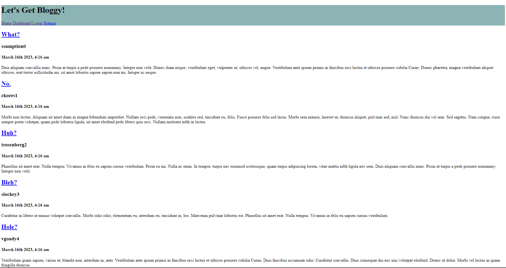

# Tech Blog

## Badges

  

## Description

I wanted to create a full-stack server-side rendering blog site that used Handlebars.js and MySQL. This was a good exercise for me in bringing lots of aspets of full-stack web development together into one functional project that was coded 'from scratch.' I got behind on this project and essentially dropped it for several weeks while I learned react. The submitted version is not fully functional, and in the future I would love to come back and finish it to my satisfaction.

## Visuals



## Links

https://tech-blog3.herokuapp.com/

https://github.com/strongjaw15/tech-blog

## License

MIT License

Copyright 2023 Corin Wenger

Permission is hereby granted, free of charge, to any person obtaining a copy of this software and associated documentation files (the "Software"), to deal in the Software without restriction, including without limitation the rights to use, copy, modify, merge, publish, distribute, sublicense, and/or sell copies of the Software, and to permit persons to whom the Software is furnished to do so, subject to the following conditions:

The above copyright notice and this permission notice shall be included in all copies or substantial portions of the Software.

THE SOFTWARE IS PROVIDED "AS IS", WITHOUT WARRANTY OF ANY KIND, EXPRESS OR IMPLIED, INCLUDING BUT NOT LIMITED TO THE WARRANTIES OF MERCHANTABILITY, FITNESS FOR A PARTICULAR PURPOSE AND NONINFRINGEMENT. IN NO EVENT SHALL THE AUTHORS OR COPYRIGHT HOLDERS BE LIABLE FOR ANY CLAIM, DAMAGES OR OTHER LIABILITY, WHETHER IN AN ACTION OF CONTRACT, TORT OR OTHERWISE, ARISING FROM, OUT OF OR IN CONNECTION WITH THE SOFTWARE OR THE USE OR OTHER DEALINGS IN THE SOFTWARE.

🏆 The previous sections are the bare minimum, and your project will ultimately determine the content of this document. You might also want to consider adding the following sections.

## How to Contribute

Contributions will be considered case-by-case. If one submits a contribution, it will have a comment inculding the identity and credentials of the contributor, and a detailed message explaining the why, what, and how of the contribution.

# Your Mission

# 14 Model-View-Controller (MVC): Tech Blog

## Your Task

Writing about tech can be just as important as making it. Developers spend plenty of time creating new applications and debugging existing codebases, but most developers also spend at least some of their time reading and writing about technical concepts, recent advancements, and new technologies. A simple Google search for any concept covered in this course returns thousands of think pieces and tutorials from developers of all skill levels!

Your task this week is to build a CMS-style blog site similar to a Wordpress site, where developers can publish their blog posts and comment on other developers’ posts as well. You’ll build this site completely from scratch and deploy it to Heroku. Your app will follow the MVC paradigm in its architectural structure, using Handlebars.js as the templating language, Sequelize as the ORM, and the express-session npm package for authentication.

## User Story

```md
AS A developer who writes about tech
I WANT a CMS-style blog site
SO THAT I can publish articles, blog posts, and my thoughts and opinions
```

## Acceptance Criteria

```md
GIVEN a CMS-style blog site
WHEN I visit the site for the first time
THEN I am presented with the homepage, which includes existing blog posts if any have been posted; navigation links for the homepage and the dashboard; and the option to log in
WHEN I click on the homepage option
THEN I am taken to the homepage
WHEN I click on any other links in the navigation
THEN I am prompted to either sign up or sign in
WHEN I choose to sign up
THEN I am prompted to create a username and password
WHEN I click on the sign-up button
THEN my user credentials are saved and I am logged into the site
WHEN I revisit the site at a later time and choose to sign in
THEN I am prompted to enter my username and password
WHEN I am signed in to the site
THEN I see navigation links for the homepage, the dashboard, and the option to log out
WHEN I click on the homepage option in the navigation
THEN I am taken to the homepage and presented with existing blog posts that include the post title and the date created
WHEN I click on an existing blog post
THEN I am presented with the post title, contents, post creator’s username, and date created for that post and have the option to leave a comment
WHEN I enter a comment and click on the submit button while signed in
THEN the comment is saved and the post is updated to display the comment, the comment creator’s username, and the date created
WHEN I click on the dashboard option in the navigation
THEN I am taken to the dashboard and presented with any blog posts I have already created and the option to add a new blog post
WHEN I click on the button to add a new blog post
THEN I am prompted to enter both a title and contents for my blog post
WHEN I click on the button to create a new blog post
THEN the title and contents of my post are saved and I am taken back to an updated dashboard with my new blog post
WHEN I click on one of my existing posts in the dashboard
THEN I am able to delete or update my post and taken back to an updated dashboard
WHEN I click on the logout option in the navigation
THEN I am signed out of the site
WHEN I am idle on the site for more than a set time
THEN I am able to view comments but I am prompted to log in again before I can add, update, or delete comments
```

## Mock-Up

The following animation demonstrates the application functionality:

 

## Getting Started

Your application’s folder structure must follow the Model-View-Controller paradigm. You’ll need to use the [express-handlebars](https://www.npmjs.com/package/express-handlebars) package to implement Handlebars.js for your Views, use the [MySQL2](https://www.npmjs.com/package/mysql2) and [Sequelize](https://www.npmjs.com/package/sequelize) packages to connect to a MySQL database for your Models, and create an Express.js API for your Controllers.

You’ll also need the [dotenv package](https://www.npmjs.com/package/dotenv) to use environment variables, the [bcrypt package](https://www.npmjs.com/package/bcrypt) to hash passwords, and the [express-session](https://www.npmjs.com/package/express-session) and [connect-session-sequelize](https://www.npmjs.com/package/connect-session-sequelize) packages to add authentication.

**Note**: The [express-session](https://www.npmjs.com/package/express-session) package stores the session data on the client in a cookie. When you are idle on the site for more than a set time, the cookie will expire and you will be required to log in again to start a new session. This is the default behavior and you do not have to do anything to your application other than implement the npm package.

## Grading Requirements

> **Note**: If a Challenge assignment submission is marked as “0”, it is considered incomplete and will not count towards your graduation requirements. Examples of incomplete submissions include the following:
>
> * A repository that has no code
>
> * A repository that includes a unique name but nothing else
>
> * A repository that includes only a README file but nothing else
>
> * A repository that only includes starter code

This Challenge is graded based on the following criteria:

### Technical Acceptance Criteria: 40%

* Satisfies all of the preceding acceptance criteria plus the following:

    * Application’s folder structure follows the Model-View-Controller paradigm.

    * Uses the [express-handlebars](https://www.npmjs.com/package/express-handlebars) package to implement Handlebars.js for your Views.

    * Application must be deployed to Heroku.

### Deployment: 32%

* Application deployed at live URL.

* Application loads with no errors.

* Application GitHub URL submitted.

* GitHub repository contains application code.

### Application Quality: 15%

* User experience is intuitive and easy to navigate.

* User interface style is clean and polished.

* Application resembles the mock-up functionality provided in the Challenge instructions.

### Repository Quality: 13%

* Repository has a unique name.

* Repository follows best practices for file structure and naming conventions.

* Repository follows best practices for class/id naming conventions, indentation, quality comments, etc.

* Repository contains multiple descriptive commit messages.

* Repository contains quality readme file with description, screenshot, and link to deployed application.

## Review

You are required to submit BOTH of the following for review:

* The URL of the functional, deployed application.

* The URL of the GitHub repository, with a unique name and a readme describing the project.

---
© 2022 edX Boot Camps LLC. Confidential and Proprietary. All Rights Reserved.
